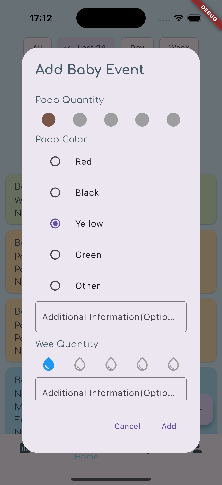
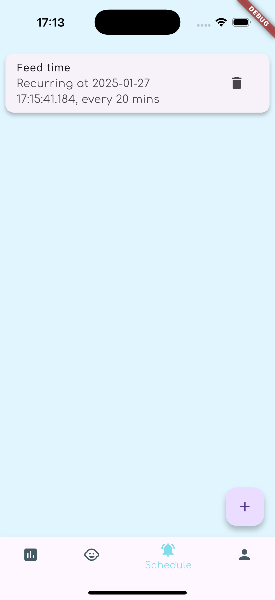
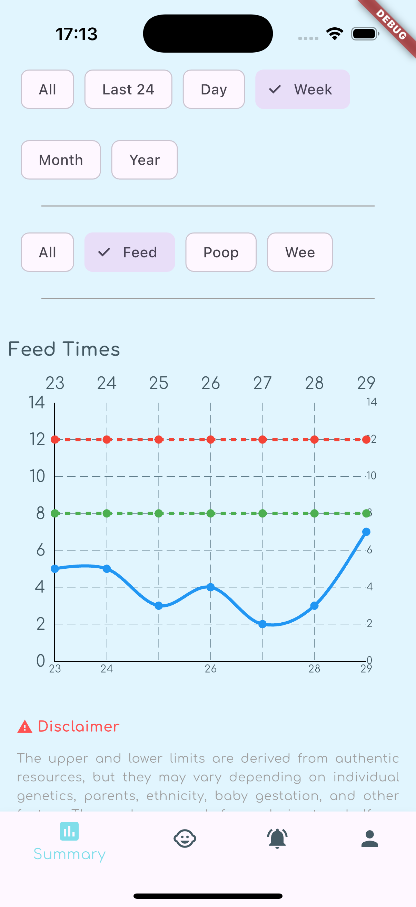
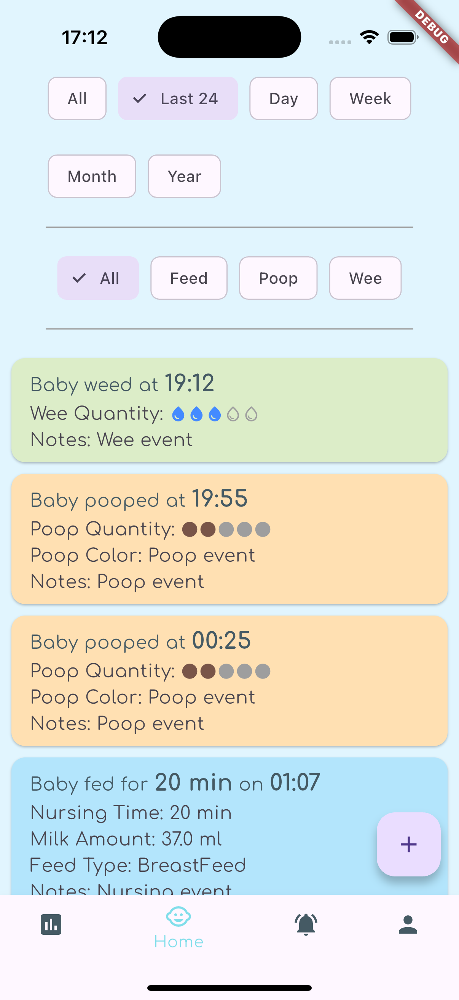
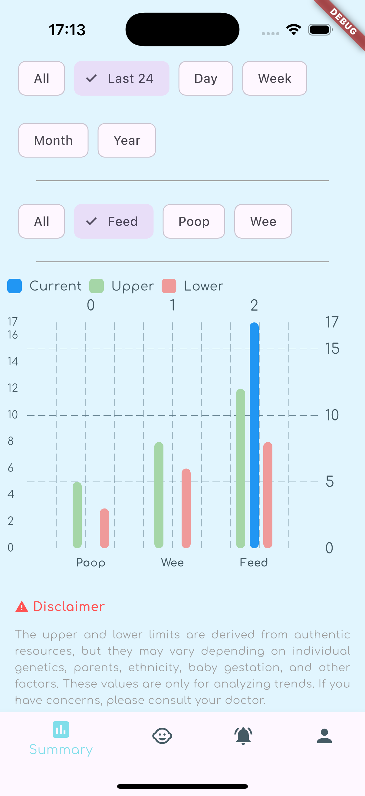
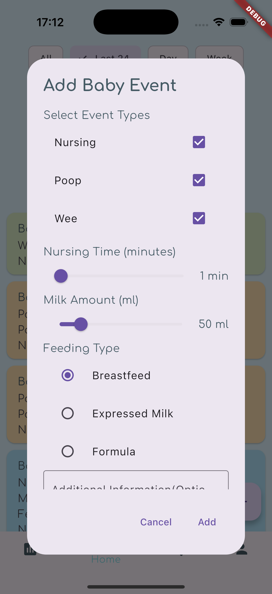

# Baby Tracker

Introducing the ultimate Baby Tracker—your perfect companion for monitoring your newborn's
activities up to their first year. Effortlessly keep track of diaper changes, feeding times, and
more, while gaining insights through consolidated reports on your baby's daily routines. Just like
the traditional red book, but with a modern twist! Set helpful timers to ensure you never miss a
feeding or nappy change, making parenting simpler and more organized.

## Screen shots

